# 
 aquar系统搭建指南

# 整体介绍

Aquar系统是一套整合了多种开源组件的系统集合。Aquar本质上是跑在Proxmox VE虚拟化平台上的若干个虚拟机以及其中自动化脚本的组合。目的是通过一定的预设置以及自动化脚本，让本来相互独立的虚拟机之间互相关联，使服务器整体上更加易用。

### 核心能力：

- 开机显示宿主机最新IP
- ups停电关机（支持施耐德及使用Viewpower的国产ups品牌）
- 预装TrueNas并配置好多种共享服务（NFS、SMB、WebDAV），且拥有合理开放的权限
- 预装多种Docker服务（NextCloud、FileRun、Syncthing、Transmission、Jellyfin、Photoprism、Navidrome、AquarHome）
- IP地址变动场景下自动重组服务配置
- 开机即用能力
- aqserv命令行管理工具
- 在硬件满足需求的情况下，可预装直通独显的Windows

运行在Aquar中的各个系统虽然彼此相关，但仍是松散且开放的，就像一套已经搭建成型的乐高积木，你可以随自己的喜好增减任何组件，但任何改动都不可避免地涉及linux以及计算机系统方面的知识。所以Aquar的第一适用人群是拥有一定技术基础的服务器爱好者或更加专业的IT从业者。不过即使你不了解计算机知识及linux系统，那么Aquar仍然可以正常运行，你也可以循序渐进的把Aquar作为游乐场来学习这些知识。如果你有能力在Aquar的基础上添砖加瓦，欢迎贡献你的配置或脚本，这可以让所有人收益。

由于Aquar目前还没有将操作系统制作成模板，所以本篇文档会重点介绍如何纯手工搭建起这套系统。另外自行安装也可以方便地设置自己的用户名及密码，这可以给系统带来更高的安全性。

# 需求与使用场景

可以看到,从零纯手工搭建系统的过程很长，因为这是长期沉淀下来的，有很多细节蕴含在其中。然而我更想强调的是，当你走完所有这些路途以后，你和这套系统磨合才真正开始。**一套软件系统是生长在使用者的需求上的，合理且充分的需求就像土壤，是软件系统存活乃至成长的必要条件。**

所以搭建系统前你需要问自己一些问题：

- 你希望使用这套系统解决什么问题？
- 这些问题是否有其他更便利的解决方式？
- 这套系统的特性是否适合你长期使用？

如果这些问题的答案都支持你搭建这套系统，那么请阅读接下来的内容，祝你好运。

# 硬件要求

### CPU

Aquar理论上可以运行在任何X86设备上，但建议至少运行在j4125及以上的设备上。

如果你需要windows虚拟机，那么至少需要这台机器在原生运行Windows时可以保持流畅。另外建议使用带有核显的CPU，否则在直通显卡以后你的宿主机控制台会被windows占用，这在系统搭建初期很不方便。

### 内存

由于TrueNas的推荐配置为16G内存（实测8G并没有问题），所以我们建议的最低内存为16G。这样可以分配8G给TrueNas，4G给服务主机，剩下4G给Windows（已经显得捉襟见肘了）。

### 独立显卡（可选）

如果你不需要跑windows，那么可以不配置独显。如上文所述，系统搭建前期建议尽量保留核显给宿主机作为排查问题的窗口，所以如果你有另外的显示需求或者硬件解码需求，还是推荐配备一个独显。独显型号需要按照你的使用方式自行斟酌，例如我选择了RTX 1050 TI，原因在于他足以满足常规工作的图形能力；拥有sheild可以使用N卡原生的串流，而且基准功耗只有75w，对家庭环境很友好。

### 硬盘

系统盘：建议使用固态硬盘以保证系统流畅。

数据盘：由于文件系统需要长期运行，并会经常伴随读写，所以需要避开叠瓦盘（SMR）。另外由于至少需要组成RAID1阵列来保证数据安全，所以至少需要两块数据盘。

### 树莓派（可选）

我当前的Aquar系统中使用了一台树莓派。它通过一台小型交换机与主体服务器保持连接。

它有以下用途：

- 运行内网穿透软件客户端
- 运行DDNS脚本
- ssh跳板机
- 为windows虚拟机提供物理按键

虽然树莓派既不负责运算也不负责存储，但它的存在对于使用整套系统的使用体验影响是巨大的。如果说系统的主机是一个忙碌的业务员，那么树莓派就是他的手机。业务员没有手机仍然可以处理业务，但是当你需要找他的时候必需去他的办公室才能找到他。

当然，解决公网访问的方式有很多，但大多数方案如内网穿透、DDN或者VPN等等，都需要一个稳定的节点暴露在公网上，这个节点并不适合放在虚拟机中，否则当你在远端无法连接服务时完全无法判断究竟是服务挂掉了还是网络链路有问题。另外如果有人想要攻击你的系统，他首先进入的是这台公网节点，如果这个节点与你的主力机共享一套硬件，那么攻击者将直接威胁到你昂贵的硬件。而如果网络节点是相对独立的，那么他首先会困在这个节点上，即使攻击者把这个节点彻底摧毁，也不过是一次小麻烦而已。

你可以选择其他设备比如其他什么派，或者智能路由器充当这个角色，但强烈建议保持这个网络连接中枢的独立性（stand alone）。

### UPS

强烈建议使用UPS保证机器的安全。ZFS在突发断电时有可能出现元数据损坏，这会导致整个阵列既无法使用也**无法恢复**，别问我怎么知道的。UPS可以选择施耐德或是国产品牌，Aquar都有相应的脚本或资料来与他们配合使用。

### U盘

你需要一个U盘来烧录pve的磁盘镜像，作为物理机安装系统的启动盘

## 其他条件

### 局域网

由于Aquar系统24小时不间断运行，而且当你做好自动化配置后你将无意间被动地与它交互。所以稳定的网络环境是必需的。Aquar对于带宽的要求并不是很高，20M以上的带宽就足以支持包括远程桌面在内的所有功能。但网络稳定是需要注意的，在一些环境下可能并不容易实现。

首先是内网IP地址的稳定，通常情况下路由器会根据设备的MAC地址给局域网中的网络设备分配一个稳定的内网IP，但并不尽然，一旦局域网的网关将Aquar中的设备IP刷新了，那么会导致你无法访问自己的服务，也无法正常访问存储池。虽然Aquar有机制应对IP浮动的情况，但这是针对频率不高的更换路由器或者搬家场景下设计的，需要重启整个系统，所以如果IP变多过于频繁，这仍然是不可接收的。

如果你的本地网络出现了这种情况，则需要修改路由器的设置来使局域网IP稳定下来。

### 公网IP

取得一个公网IP对于提升系统易用性的好处是很大的。最直接的好处就是你可以通过DDNS工具来让自己在公网上直接访问到Aquar上的服务，否则你就需要借助各种内网穿透手段达到相同的目的。另外一点也很重要，就是远程桌面软件parsec在没有公网IP的情况下将很难建立起连接，而parsec恰恰是目前远程桌面软件中体验最好的那个。

### 场地

系统运行时不可避免的产生噪音，主要是风扇声以及机械硬盘写入的声音。即使你使用无风扇的低功耗平台来搭建系统，机械硬盘的声音也是不容小觑的，所以强烈不建议将机器放在卧室等休息的地方。

# 搭建步骤

## 系统安装

Aquar涉及的系统安装过程在网上有很多优秀的文章，建议配合网上优秀的文章一起参考。我会列出必要的步骤和注意事项同时给出官方文档链接，这些信息可以帮助你少走很多弯路，在安装一个系统前请先看这些内容再开始。

### 宿主机安装PVE([Proxmox Virtual Environment](https://www.proxmox.com/en/downloads/category/proxmox-virtual-environment))

**0.备份数据**

安装系统后系统盘的所有数据将被清除，请先保存重要的数据再执行系统安装操作。

**1.下载镜像**

pve的镜像官网下载页面：https://www.proxmox.com/en/downloads/category/iso-images-pve

我目前使用的版本是7.1-7，建议直接下载最新版本即可。

**2.制作启动盘**

根据官方文档及我自己的实践，推荐使用Etcher制作启动盘，Rufus的设置略繁琐。

Etcher下载地址：[https://pve.proxmox.com/pve-docs/pve-admin-guide.html#installation\_prepare\_media](https://pve.proxmox.com/pve-docs/pve-admin-guide.html#installation_prepare_media)

**3.安装PVE**

将启动盘插入物理机，重启进入BIOS，选择从启动盘启动，然后进入安装流程。

安装过程中pve会让你设置一个域名，并不关键，按默认即可。

安装流程的官方文档：https://pve.proxmox.com/pve-docs/pve-admin-guide.html#installation_installer

**4.验证安装**

PVE安装完成后，首先在你的物理机屏幕上会显示出服务的IP地址（大概类似[https://192.168.X.XXX:8006/](https://youripaddress:8006/))，注意是https协议，在局域网下打开这个地址，你就可以看到PVE的WEB控制台了。默认用户是root，密码是你安装时设置的。

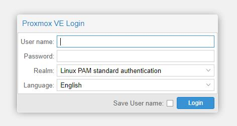

### 安装TrueNAS core

最近TrueNas推出了基于Linux的TrueNAS scale，对Linux生态友好了很多，这使得TrueNAS scale上可以直接搭载Docker服务。但由于Aquar使用PVE这种虚拟化平台作为底层系统，所以没有必要在TrueNAS 上搭载其他服务，所以仍然选择经受了长期考验的TrueNAS  core作为存储管理中心。

**1.下载镜像**

TrueNAS core的下载页面：https://www.truenas.com/download-truenas-core/

刚进入时会提示你注册，点击右下角的No Thanks即可看到下载链接了。推荐直接下载最新版本即可。

**2.上传镜像到PVE**

在左侧的树状图中选择pve节点的local存储，在右侧选择ISO images，然后点upload，上传你的在上一步下载的TrueNAS core ISO文件。你可以提前下载后面两节需要用到的镜像，然后集中上传，这可以节省很多时间。

**3.创建虚拟机**

在pve的web页面的右上角点击Create VM，为TrueNAS创建一个虚拟机。

****

通用信息配置中勾选右下角的Advanced，并把这个虚拟机设置为开机自启动，然后设置启动顺序为1，等待时间60(秒)，需要注意的是这里的等待时间指的是这台虚拟机开机后等待下一台虚拟机开机的时间，而不是他与上一台虚拟机开机的等待时间。**设置合理的启动顺序和等待时间非常重要**，否则会影响上层服务的存储池挂载。

**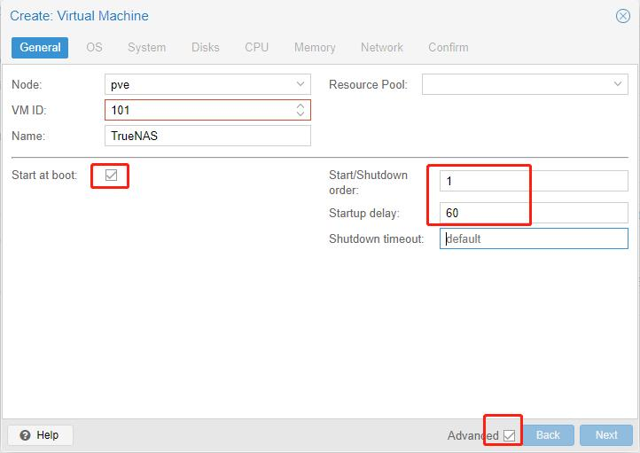**

OS配置页面选择你上传的TrueNAS IOS镜像，并设置操作系统类型为Other（我不确定TrueNAS core是不是Solaris OS）

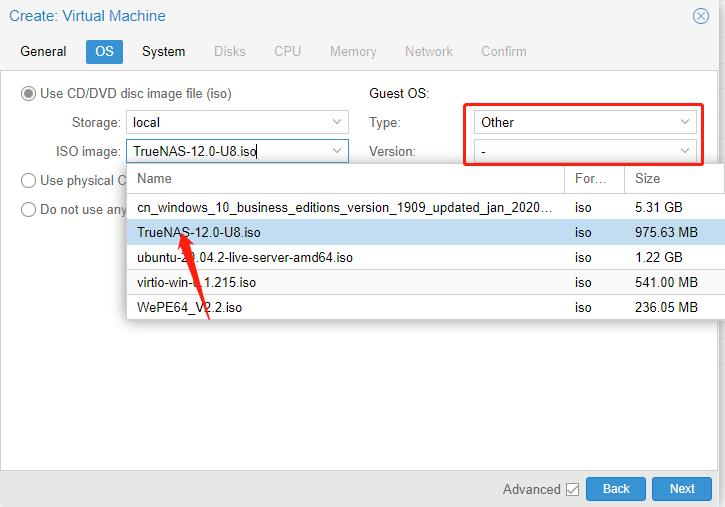

系统配置页面我的配置如下：

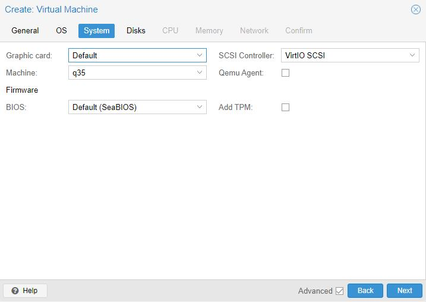

系统磁盘空间我分配了32G，其他配置项没有需要修改的地方

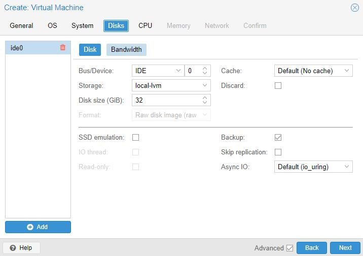

CPU分配了2核，另外CPU类型选择了host，据说可以提升性能。

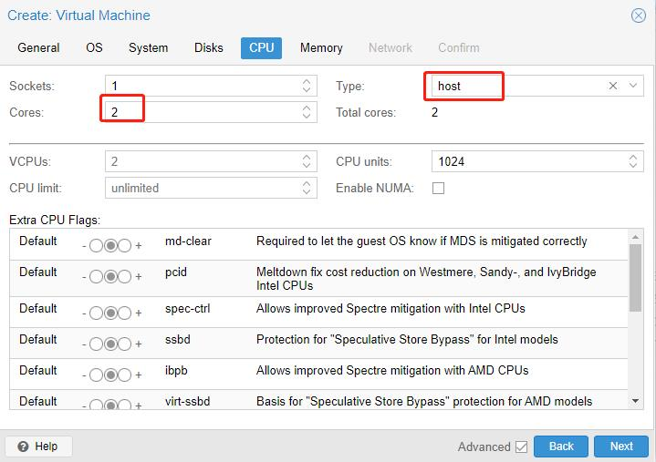

内存方面由于TrueNAS推荐使用16G以上内存空间，所以分配了16G内存，但实测在8G内存下也可以正常运行。

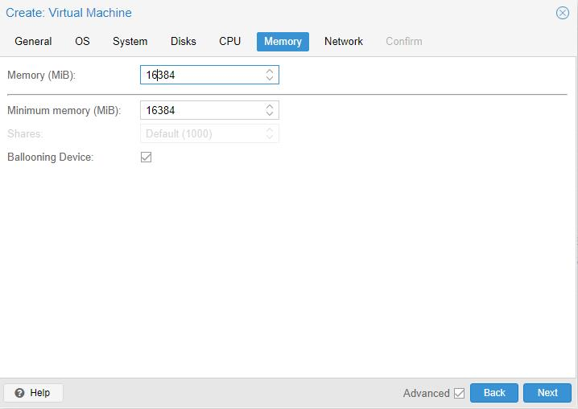

网络方面我暂时修改默认配置，未来应该可以将网络类型换成VirtlIO以提升性能。欢迎在这方面尝试成功的朋友补充文档。

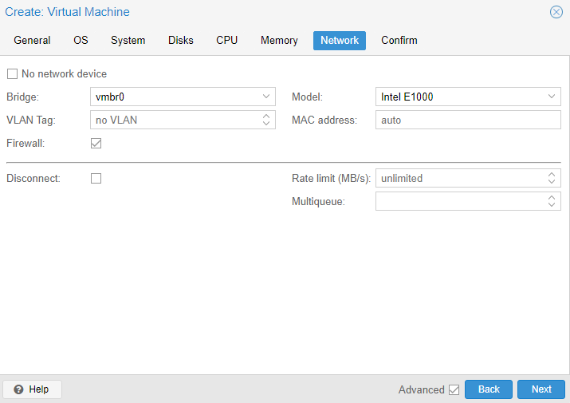

进入到确认页面后点击创建就可以了。我的目前使用的配置如下：

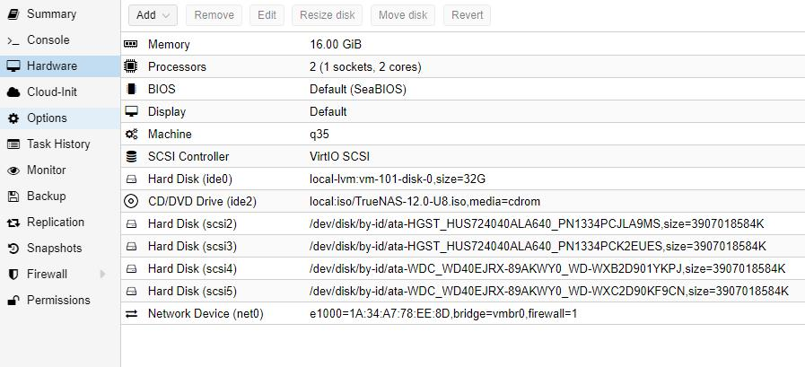

虚拟机创建成功后，打开他的console应该就可以看到安装提示了。

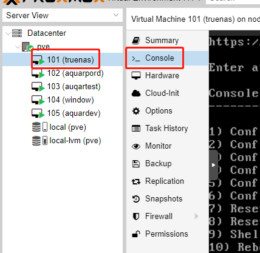

**4.安装TrueNAS core**

TrueNAS官方文档：https://www.truenas.com/docs/core/corepreviousversion/

在大概第20页的安装章节可以看到指引。安装时没有什么特别需要注意之处。

由于在一些USB设备连接不稳定的情况下，TrueNAS虚拟机会收到USB热插拔的影响而死机，所以安装完成以后打开虚拟机的Options（选项）页，双击Hotplug设置项，把USB选项的勾选去掉。

**5.验证安装**

TrueNAS安装成功后应该可以在console上看到类似下面的提示，在局域网中使用浏览器打开提示中的地址应该就可以看到TrueNAS的Web页面了。

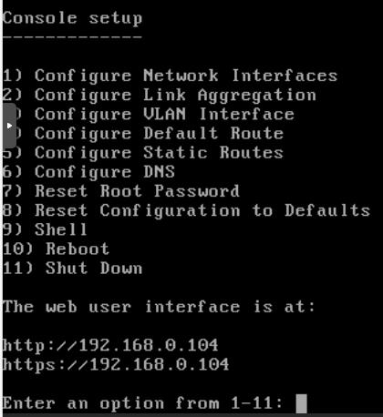

默认用户名是root，密码是在安装时设置。

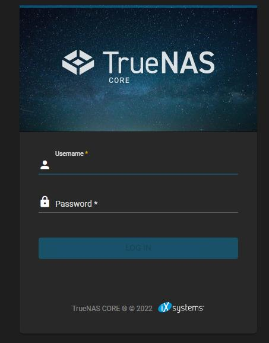

### 安装ubuntu

**1.下载镜像**

由于我们使用ubuntu的作用主要是承载各种服务而非直接与之交互，所以选择没有GUI的Ubuntu Server版本。

Ubuntu Server下载页面：https://cn.ubuntu.com/download/server/step1

选择最新的LTS版本即可，目前最新的LTS版本是22，我使用的是20版本。

**2.上传镜像**

与TrueNAS章节的上传操作一致，不再重复。

**3.创建虚拟机**

与TrueNAS章节的创建操作类似，在此列出我配置好的信息截图。

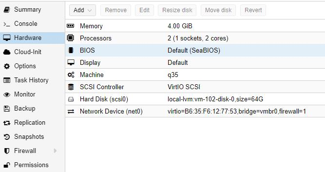

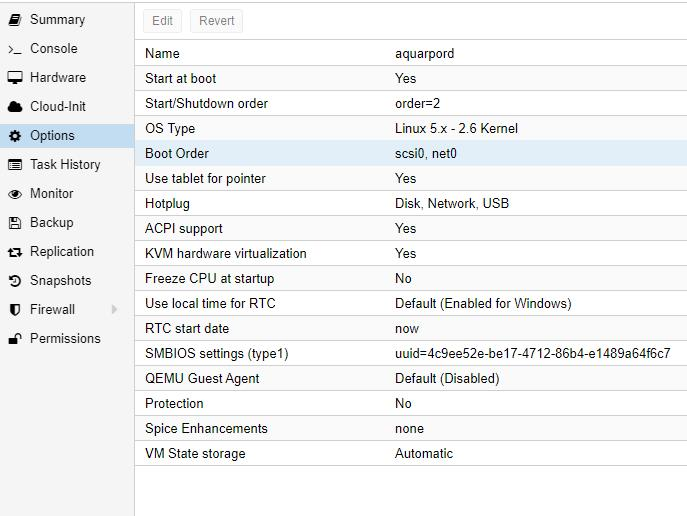

**4.安装Ubuntu Server**

Ubuntu Server官方文档的安装指引：https://ubuntu.com/server/docs/install/step-by-step

安装时有几点需要注意：

1.  Mirror设置时，Ubuntu现在默认为国内源地址，如果不是的话请更换成你所在的地区最稳定的地址。
2.  在存储设置时Ubuntu默认只使用磁盘的一半空间，需要手动将剩余的磁盘空间设置上去。
3.  SSH设置时勾选Install SSH Server
4.  Snaps页面不要选择任何软件进行安装。
5.  在Ubuntu安装开始执行一段时间后（大概几分钟），会开始拉取软件源信息，没必要等待，直接选择"跳过并重启"即可。

**5.验证安装**

在PVE中找到Ubuntu的虚拟机，并进入Console界面，多按动几次回车键，如果看到类似的提示，则输入你安装时设置的用户名和密码。如果登录成功则说明系统正常运行了。

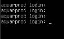

### 安装Windows（可选）

**1.下载镜像**

windows下载镜像前需要先下载一个工具，相当于windows镜像的下载器。在下载器上选择“为另一台电脑创建安装介质（U盘、DVD或者ISO文件）”的选项后即可下载纯净的windows iso镜像。

下载页面：https://www.microsoft.com/zh-cn/software-download/windows10

**2.上传镜像至PVE**

参考TrueNAS章节的做法，不再重复。

**3.创建虚拟机**

Windows虚拟机的创建步骤参考TruNAS章节，但需要注意如下几点：

- 在系统配置时使用q35机型，否则后续将无法直通显卡。
- 将BIOS设置为OVMF(UEFI)，EFI存储设置为local-lvm即可。
- 勾选添加TPM，TPM存储设置为local-lvm即可，版本v2.0
- 在CPU设置时，类型选择host以提升性能。
- 在网络配置时选择virtIO类型以提升网络性能，但这种方式需要安装完Windows后再手动安装VirtIO驱动。

**4.安装Windows系统**

在PVE的Windows虚拟机中打开Console，就可以看到安装界面了。Windows安装没有任何需要注意的地方，按照自己的习惯安装即可。

**5.验证安装**

在PVE的Windows虚拟机中打开Console，可以看到Windows的登录页面，就表示Windows安装成功了。

**6.安装VirtlIO驱动**

由于选择了VirtIO的虚拟化网络类型，Windows刚装好时是无法联网的，所以还需要安装驱动。

VirtrIO驱动下载地址：https://fedorapeople.org/groups/virt/virtio-win/direct-downloads/stable-virtio/virtio-win.iso

下载好驱动后同样上传至PVE。

然后在Windows虚拟机的操作页面上选择Hardware -> 点击Add -> 选择CD/DVD Drive。

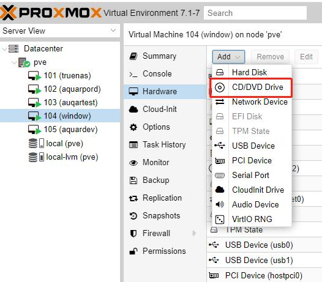

选择VirtIO的iso文件，点击创建。

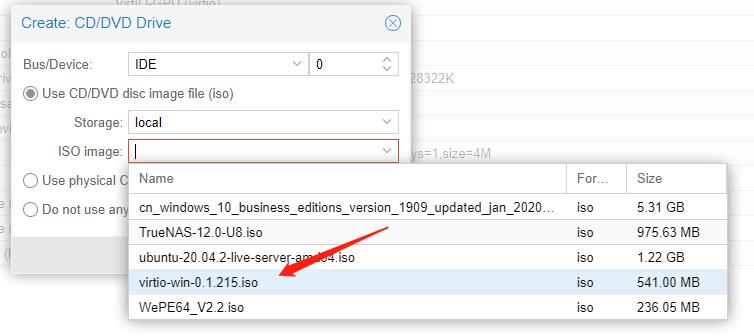

然后硬件信息栏中会出现VirtIO的设备信息，并呈现橙色，这时候重启Windows虚拟机，重启后你就可以在“我的电脑”中看到多了一个CD驱动器，里面装有VirtIO的安装程序了，点击exe安装，然后再重启机器，你就可以正常上网了。

## 脚本及配置

基础的服务器搭建完毕后，我们就可以开始使用脚本和配置在系统之上建立一套应用集合并让他们彼此关联。这个阶段涉及到大量命令行操作，这篇文档假定你掌握以下知识：

- 理解超级用户及普通用户身份的差别及互相切换方式
- 理解文件的读写执行权限，并知道如何赋权
- vi/vim文本编辑器的基本使用方法（打开、导航、修改、保存、退出）

另外如果你了解以下知识会对整个配置过程更加得心应手：

- 硬盘阵列不同RAID类型的区别
- systemd系统服务的配置及使用
- docker的基本概念及使用方式
- NFS目录挂载操作方式及权限压缩机制

在掌握了上文提到的基础知识后你就可以开始尝试进行配置了，祝你顺利。

### 宿主机：

- [设置PVE的apt源](./details/设置PVE的apt源.md)
- [将PVE设置为DHCP动态地址](./details/把pve配置成DHCP.md)
- [开机IP自检及更新脚本](./details/开机IP自检及更新脚本.md)
- UPS配置
  - [apc施耐德](./details/pve下安装施耐德ups配套软件及简单配置.md)
  - [雷迪司](./details/雷迪司Viewpower在pve上的部署.md)
- [为虚拟机添加物理开关](./details/给虚拟机加装一个物理开机键.md)

TrueNas：
- [硬盘直通](./details/pve硬盘直通.md)
- [配置存储池](./details/TrueNAS存储池配置.md)
- [配置用户及权限](./details/truenas下配置用户及权限.md)
- [配置NFS](./details/TrueNAS下的NFS服务配置.md)
- [配置SMB](./details/TrueNas配置SMB.md)
- [配置WebDAV](./details/TrueNAS下的WebDAV服务配置.md)

服务主机ubuntu：

- [使用setup_aquar.sh脚本进行环境初始化](./details/使用setup_aquar.sh脚本进行环境初始化.md)
- [设置docker-compose等待nfs挂载后再启动](./details/设置docker-compose等待nfs挂载后再启动.md)
- [使用truenasseeker.py脚本自动扫描nfs服务并挂载](./details/使用truenasseeker.py脚本自动扫描nfs服务并挂载.md)

Windows虚拟机：

- [SMB挂载](./details/TrueNas配置SMB.md)（参考TrueNAS配置SMB服务的后半段）
- [显卡直通](./details/pve虚拟机设置及独显直通.md)
- [USB直通](./details/pve下直通usb.md)

## 服务初始化配置
在服务跑起来之后，他们大多数应用都需要一个初始化配置的过程，大部分配置比较简单，可以凭借页面的提示直接完成，同时也可以去参考各个应用的官方文档页面。在此我列出一些与Aquar环境相关的几个注意事项：

1. setup_aquar.sh脚本会将NFS服务挂载在`/opt/aquar/storages/aquarpool/`路径下，默认的docker应用配置大多使用了这个目录或者其子目录。
2. aquar启动了一个公用的mariadb数据库容器来满足一些依赖数据库服务的容器需求，而有赖于docker本身的网络别名机制，当需要配置数据库地址时，我们只需要写“mariadb”即可，docker的虚拟网络会帮我们找到数据库服务。这在Nextcloud的初始化配置时非常关键。
3. 如果你发现自己不知道docker系统的默认用户名和密码，请先核对位于`/opt/aquar/src/docker-compose/docker-compose.yml`的docker配置信息，如果你想修改配置信息，也应该在这里修改。

## 与系统磨合

当你的应用容器启动并初始化完成后，Aquar系统的大部分核心能力就已经具备了，走过这么长的路实属不易。

然而你和这个系统的磨合才刚刚开始。再次强调文档开头的话：“软件系统**生长**在使用者的需求之上。”你的需求是它存在的基础。在此后的很长一段时间内，你将由自己的需求驱动，深入地调整每一个docker服务，配置每一项AquarHome组件，下载应用对应地app，搭建自己的自动化同步体系等等。这个过程比搭建系统本身更加漫长，也更加重要，它决定了你和这套系统的相处是细水长流还是三分热度。希望你能在探索和磨合中享受这个过程。

AquarHome的详细配置文档如下，不得不说，配置AquarHome的过程同样需要很多耐心和时间，希望这些都值得。

[https://gitee.com/firemaker/aquar-home-helper](https://gitee.com/firemaker/aquar-home-helper)