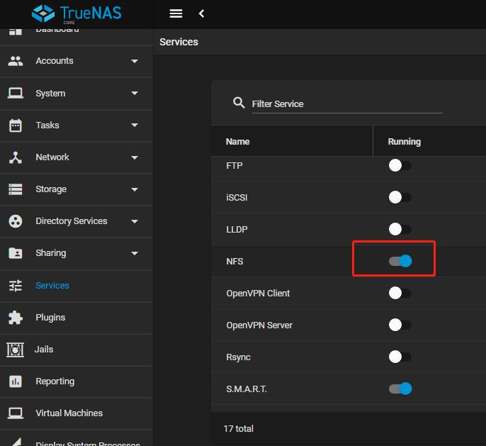
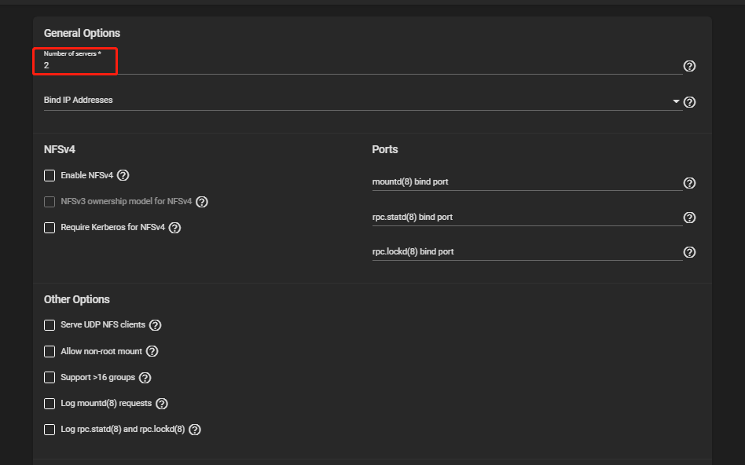
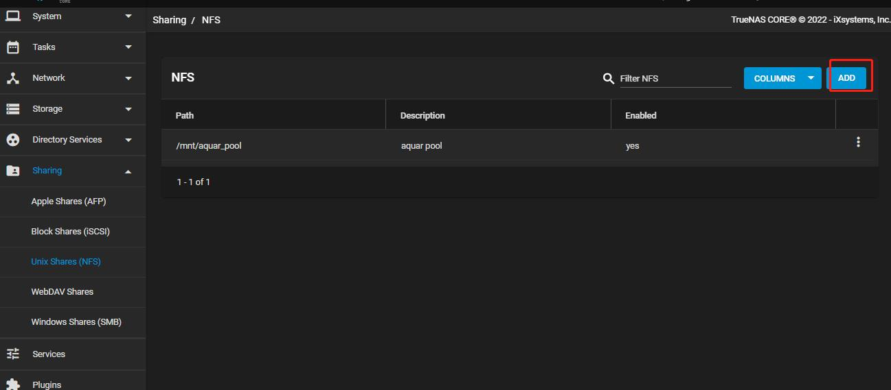
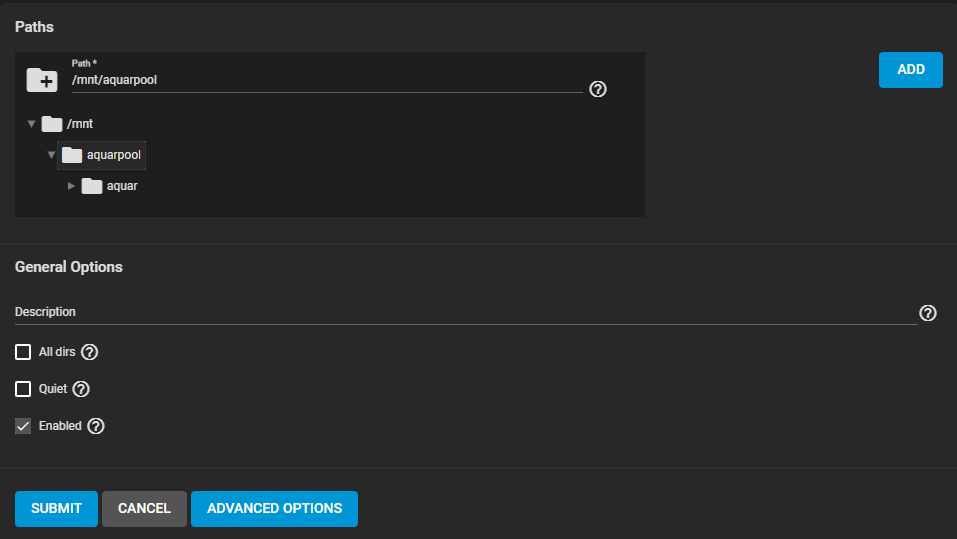
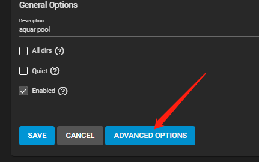
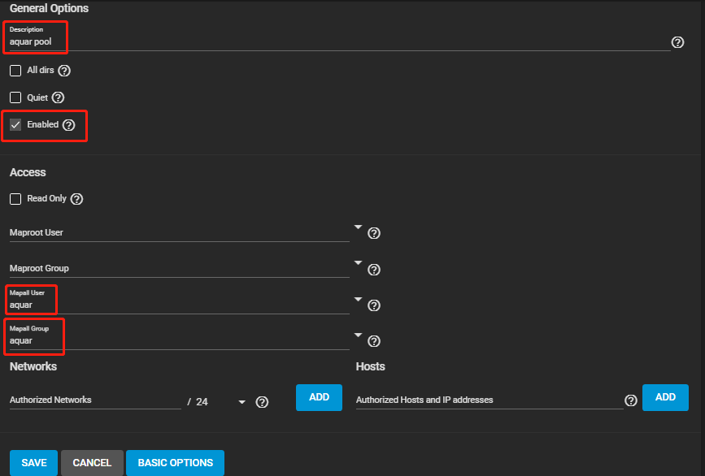

TrueNAS下的NFS服务配置

1.在TrueNAS的Web页面上进入Services页面，将NFS服务开关打开。

2.点击后面的编辑按钮，设置Number of servers为cpu核数，这里我给虚拟机的核数是2，所以填2。

3.进入Sharing->Unix Shares(NFS)页面，点击右上角的ADD按钮，新建一个共享目录

4.在表单中选择/mnt/目录下自己存储池同名的文件夹

5.点击ADVANCED OPTIONS，高级选项。设置NFS的描述信息，勾选Enabled启用NFS共享，然后在高级选项中设置为将所有用户的操作都映射为aquar用户。（aquar用户创建步骤及原因解释请参考用户配置章节）

6.配置完成后点击SAVE保存NFS配置。