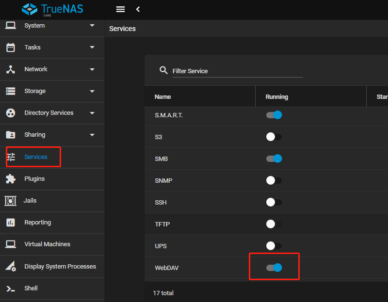
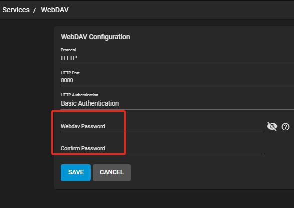
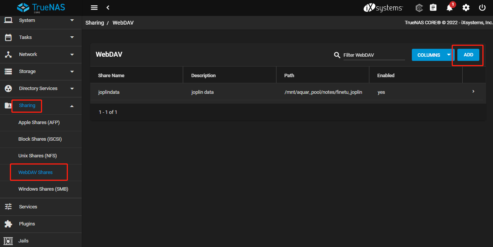
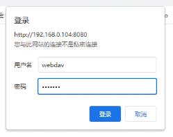
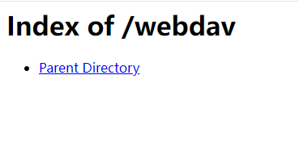

TrueNAS下的WebDAV服务配置

1.在TrueNAS的Web界面中进入Services页面，将WebDAV服务的开关打开

2.点击后面的编辑按钮，选择鉴权方式选择Basic Authentication，设置自己的webDAV服务密码。

3.进入Sharing-> WebDAV Shares页面，点击ADD按钮，创建新的WebDAV共享目录。

4.选择自己想要使用WebDAV服务共享的目录，这里我只需要使用WebDAV同步joplin笔记数据，所以仅选择了存放joplin数据的目录。另外需勾选Change User & Group Ownership选项，在TrueNAS下，WebDAV服务的用户名必须是"webdav"，我尝试赋权给其他用户但没有成功。

5.验证服务

打开浏览器，输入`http:[TrueNAS内网地址]:8080[/WebDAV服务的名称]`（例如http://192.168.0.104:8080/webdav）如果页面弹出登录提示说明服务已经启动。

用户名填写webdav，密码填写在Services页面设置的密码，即可在网页中看到共享目录中的内容。

