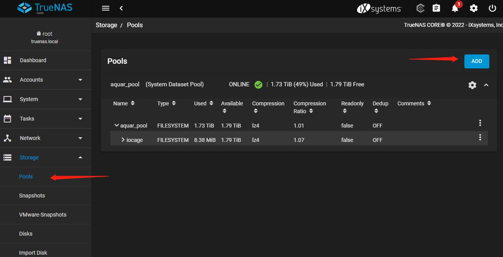
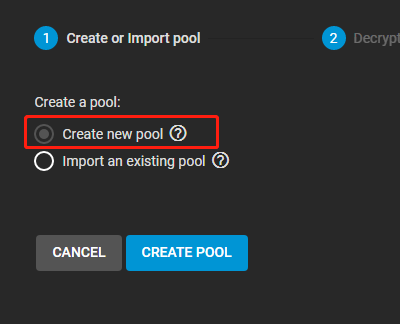
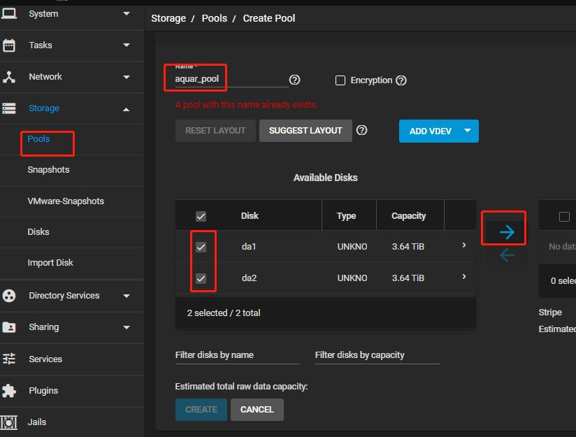
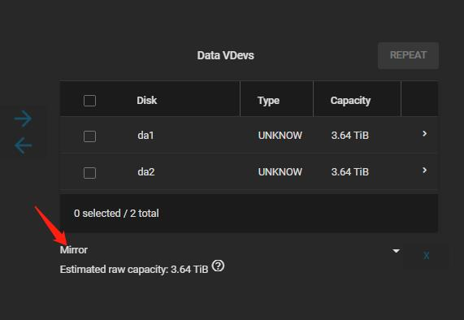

TrueNAS存储池配置

1.登录TrueNAS的Web页面，进入Storage -> Pools 页面，点击ADD按钮

2.选择create new pool。

3.在创建存储池页面上填写存储池名称，选择想要纳入的磁盘，然后点击右箭头。

4.在右侧下方选择适合自己的RAID类型，图中Mirror等价于RAID1。

5.点击左下角的CREATE按钮，即可创建出名为aquar_pool的存储池