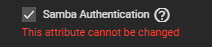
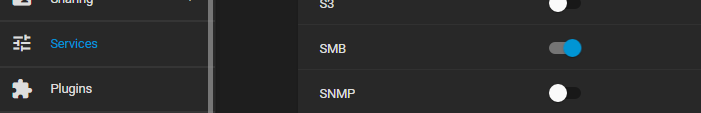
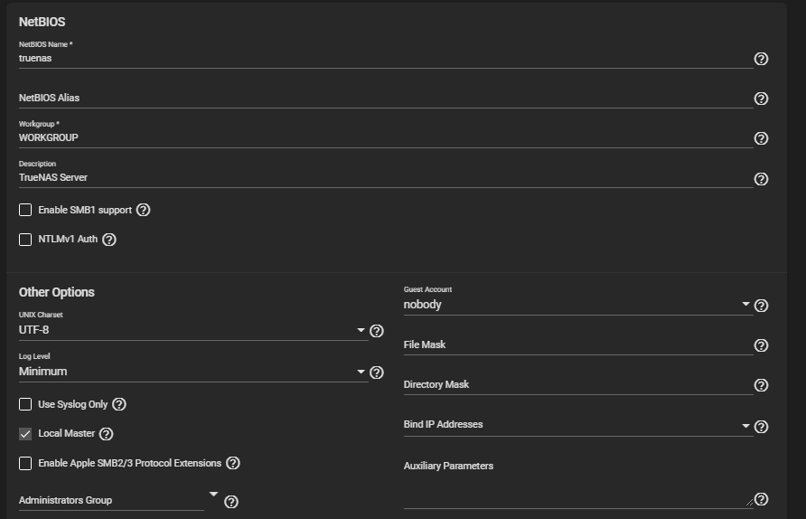
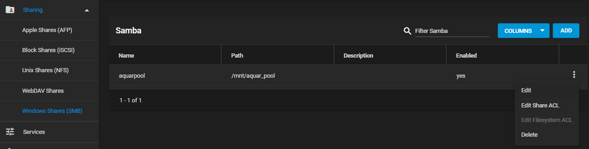
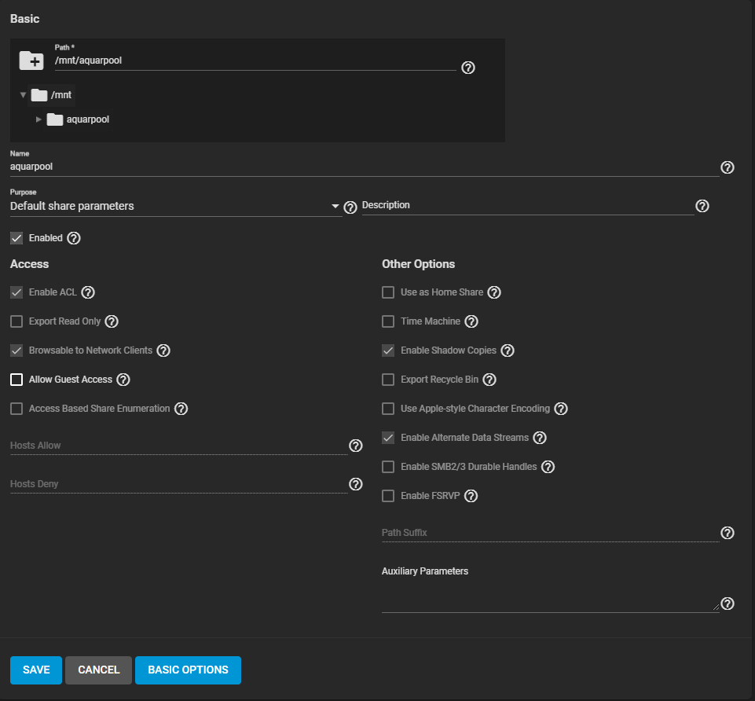
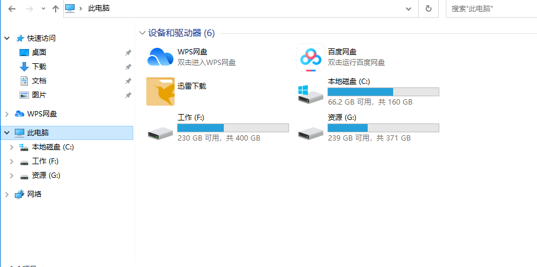
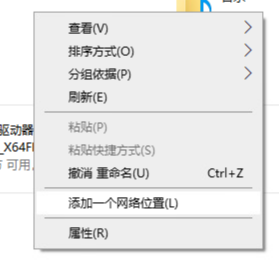
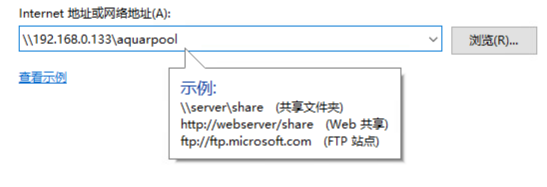
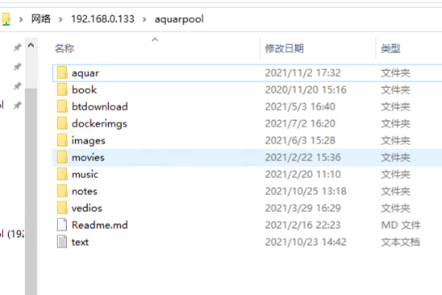

TrueNas配置SMB

1.确认在[用户配置章节](./truenas下配置用户及权限.md)创建的用户aquar勾选了samba Ahthentication选项。

2.在TrueNAS Web页面的Services功能下，把SMB服务打开，点击后面的编辑按钮可以查看具体的配置，我没有做任何修改，截图如下。

3.然后转到sharing下配置想要共享出去的目录，选择存储池的根目录，配置上同样没有做什么特殊的改动，截图供参考。

4.在同一个局域网中，在文件管理器显示各个硬盘页面的空白处右键，选择“添加一个网络位置”。

5.一番下一步后会让你输入地址，填写truenas的服务地址然后又是一番下一步，最后会询问你用户名和密码，这时候就填写你在TrueNas上新创建的用户的名称和密码即可。

