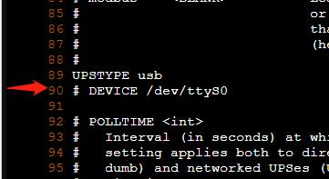
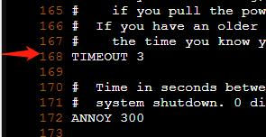
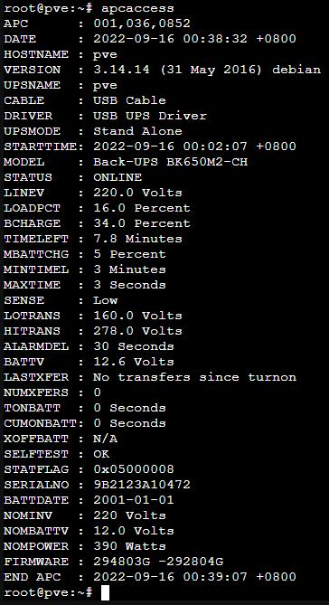

pve下安装施耐德ups配套软件及简单配置 

1.在pve的节点下打开console，安装apcupsd程序

```shell
apt-get install apcupsd
```

2.执行`cp /etc/apcupsd/apcupsd.conf /etc/apcupsd/apcupsd.conf.bak`备份原有的配置文件

3.执行`vi /etc/apcupsd/apcupsd.conf`打开配置文件，修改默认配置文件中的两处配置。

(1).注释掉默认的DEVICE配置，大概在第90行位置，否则会无法连接到ups



(2).修改TIMEOUT配置为3，即电池供电3分钟后尝试关机。此处默认为0，意为不根据供电时间触发关机。



3.重启apcupsd服务

```shell
systemctl restart apcupsd.service
```

4.执行apcaccess查看状态，若输出与下图类似，有剩余电量信息及输出电压信息等，即表示ups连接正常。



5.拔掉ups的电源测试系统是否可以被正常关机