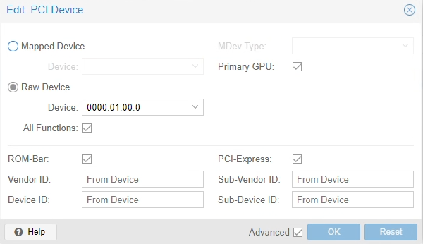
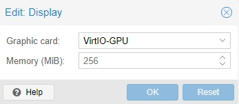

pve 虚拟机设置及硬盘、显卡、usb设备直通

## 准备

给虚拟机直通设备都需要先把虚拟机建立出来，所以第一步是先把想要使用直通设备的虚拟机创建出来并且安装好系统。
需要注意的是，如果虚拟机需要直通显卡，那么这台虚拟机需要在创建虚拟机时进行以下设置：
常规设置下：
1.将机型设置为q35
2.scsi控制器设置为VirtIO SCSI
3.将BIOS设置为OVMF(UEFI)，EFI存储设置为local-lvm即可。
4.勾选添加TPM，TPM存储设置为local-lvm即可，版本v2.0
CPU设置下：
5将类型设置为host,这样可以获取cpu的所有指令集
网络设置下：
1.将“模型”设置为VirtIO(半虚拟化)，这是除了直通网卡外性能最好的方案。

安装完虚拟机后，如果网络使用的是VirtIO，还需要去网上下载与虚拟机系统对应的VirtIO驱动，安装完成后才可以联网。

## 显卡直通


1.进入pve节点的shell，执行`vi /etc/default/grub` ,在大概第8行的位置找到

```
GRUB_CMDLINE_LINUX_DEFAULT="quiet"
```

把它改成如下内容， 如果是amd cpu则改成amd_iommu：

```
GRUB_CMDLINE_LINUX_DEFAULT="quiet intel_iommu=on iommu=pt initcall_blacklist=sysfb_init pcie_acs_override=downstream"

```

改完后：wq保存退出
2.执行`update-grub`

3.执行`vi /etc/modules`,在非注释的位置添加如下内容：

```ini
vfio
vfio_iommu_type1
vfio_pci
```

添加完后如下所示

```ini
# /etc/modules: kernel modules to load at boot time.
#
# This file contains the names of kernel modules that should be loaded
# at boot time, one per line. Lines beginning with "#" are ignored.
vfio
vfio_iommu_type1
vfio_pci
```

完成后：wq保存退出

4.执行`update-grub`

5.关闭需要直通显卡的虚拟机

6,重启pve

7.在硬件设置功能中点添加-> PCI设备，在设备列表中选择想要直通的显卡。打开“高级"设置项，勾选“所有功能”，勾选主GPU（Primary GPU），勾选PCI-Express，



8.打开虚拟机可以看到已经有这个设备了，但是显示没有驱动，到官网上下载驱动，安装好以后显卡就可以正常使用了。

9.将原来的虚拟显卡去掉。关闭虚拟机，将硬件列表中原来的显示（Display）设置为：VirtIO-GPU。经试验，这样配置可以在同时使web console显示及物理显示器画面正常，并且parsec可以正常调用独显的解码。



11.给独显的接口连接上显示器，重新打开虚拟机， 如果一切正常的话，就可以看到开机画面了。安装parsec并启动后，也可以正常远程连接。
