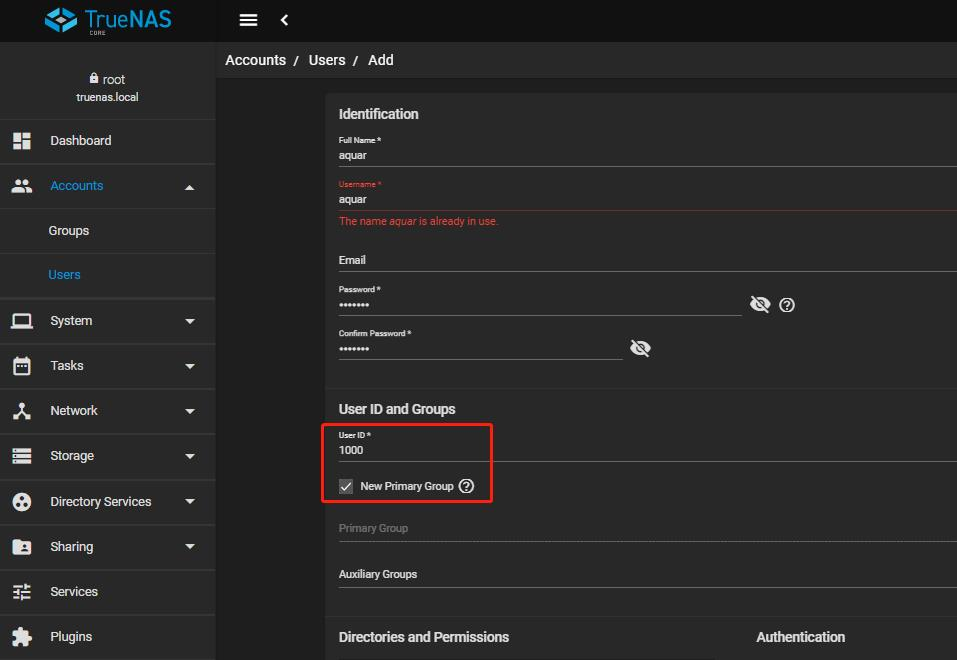
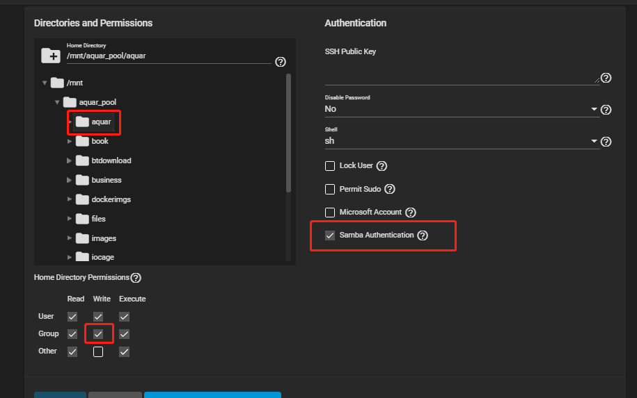

truenas下配置用户及权限

1.在TureNAS Web页面的Accounts->users页面中点击ADD，创建aquar用户，指定uid=1000，并勾选New Primary Group，这样一来他的gid也是1000，这样会天然对应上ubuntu环境下的第一个用户从而解决NFS的用户权限问题。

2.在下面的设置中在存储池中新建一个aquar目录作为aquar的家目录（可以在TrueNAS的Shell页面中`mkdir /mnt/aquar_pool/aquar`），目录权限勾选如下图所示，并勾选Samba Authentication选项。

3.设置nfs共享选项的高级，映射所有用户到aquar用户（详见[NFS设置章节](./TrueNAS下的NFS服务配置.md)）

4.在truenas的终端中chown -R aquar:aquar /mnt/aquar_pool

~~5.把aquar用户添加到gid=666组中，与webdav用户同组~~

~~6.设置webdav共享目录权限为775（实验后发现不行，所以目前webdav目录的所有者必需是webdav用户）~~