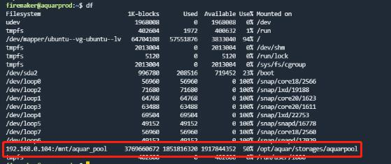

[setup_aquar.sh](./../files/setup_aquar.sh)是aquar系统中最复杂的脚本，他能够在ubuntu环境中初始化各种配置，包括必要的常用软件下载，NFS挂载配置，python环境及虚拟环境下载，docker及docker-compose安装与配置，aqserv命令安装，docker镜像预装配置，docker-compose启动等内容。脚本执行的不确定性较大，也会消耗较长的时间，所以在执行脚本前你需要仔细进行准备工作。

## 执行步骤

1.确定你的NFS服务的IP地址（如192.168.0.104），并确认你NFS服务的目录名称（如aquar_pool)。其中IP地址是在调用脚本是需要传入的唯一参数。NFS目录名需要你在脚本的第13行及第18行根据你自己的命名来修正。

2.在脚本的第97行至第279行是docker容器配置信息，你需要核对以下几个事项：
- 你可以根据自己的需求去掉你不需要的应用。
- 一些应用会的配置信息中会带有初始用户名和密码信息，如160行的photoprism默认密码，218~219行的transmission默认用户名及密码。请根据自己的需求修改这些信息。
- 其中大部分容器都使用了挂载卷(volume)，你需要根据自己的需求调整这些挂载点配置。你也可以不修改这些挂载信息，按照我默认的配置来执行。

3.登录ubuntu系统，`sudo -i`后输入密码，切换到超级用户，将[setup_aquar.sh](./../files/setup_aquar.sh)拷贝到机器上（如`/root/`目录）

4.执行`/bin/bash /root/setup_aquar.sh 192.168.0.104`，然后等待他执行完成。执行期间需要下载大量的包，如果中间出现了超时等问题，你可以重复执行这个命令，这个脚本是幂等（多次执行不影响效果）的。  
如果脚本已经开始下载docker镜像，但下载镜像过程中中断了，那意味着脚本已经执行成功，你可以关掉当前终端界面，重新进入一次，切换超级用户后执行`aqserv start`命令，这条命令将直接尝试拉起docker-conmpose中的所有服务。

## 验证

1.执行`df`命令，在输出信息中会出现NFS的挂载信息。

2.在`/opt/aquar/storages/aquarpool/`目录下会出现你存储池中的所有文件。

3.在超级用户下执行`aqserv -h`命令会显示帮助信息。

4.执行`aqserv ps`命令查看容器状态是否为"UP"。

5.等待大约10分钟后，尝试访问docker中的各个服务，看服务是否正常。

如果上面这些验证都顺利通过了，那么恭喜你，最棘手的部分已经度过了。
