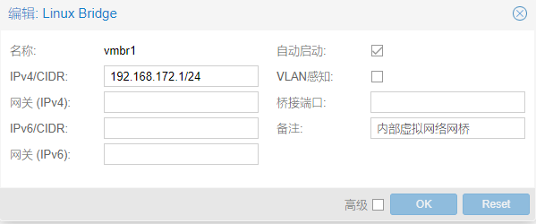
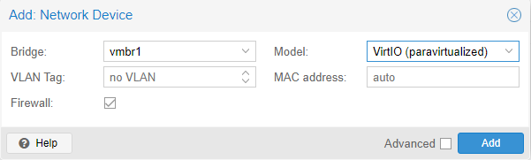
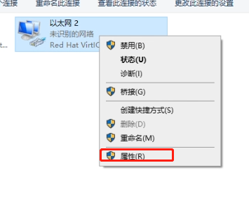
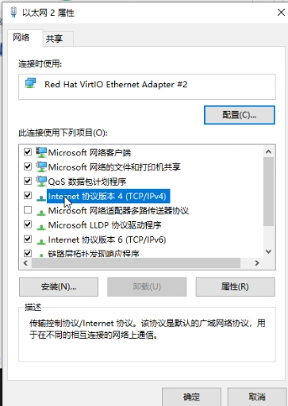
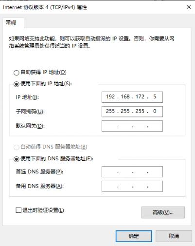
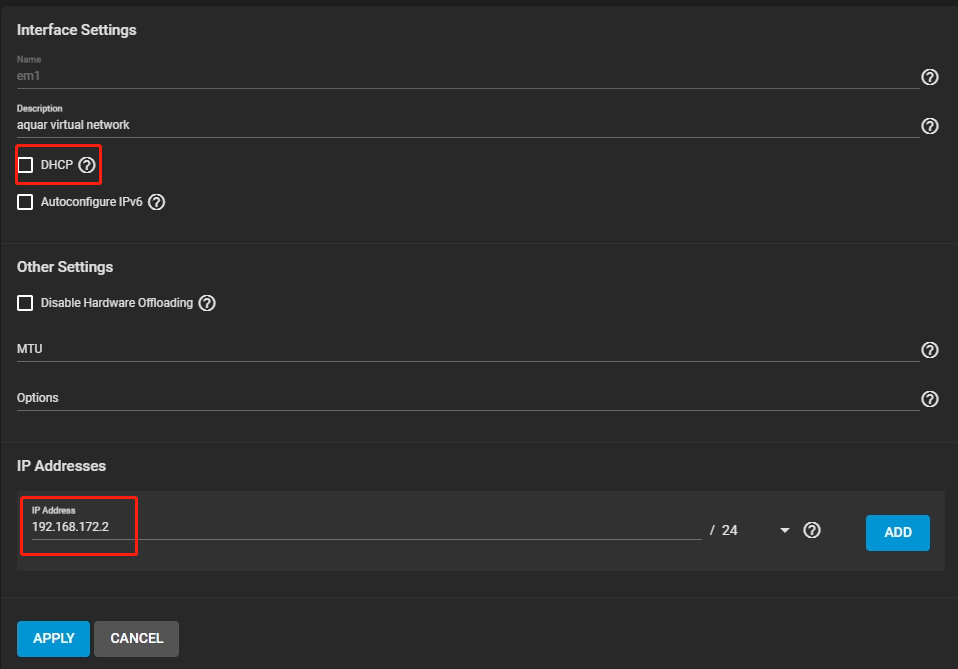
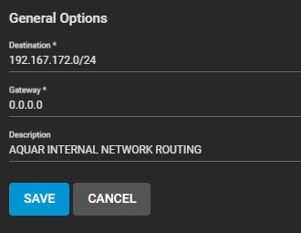
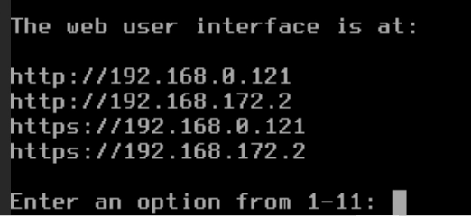
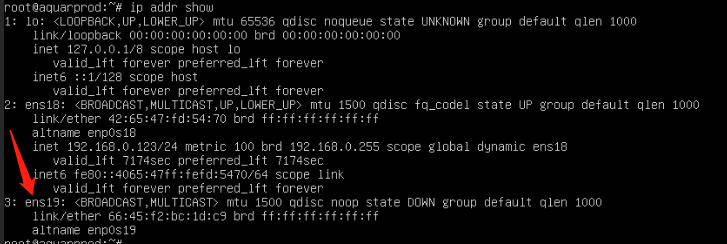
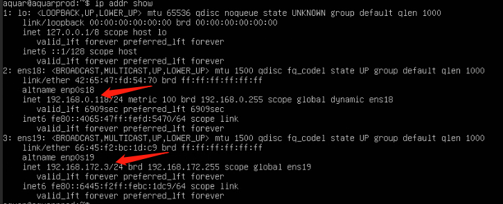

## 概念及原理
在最初的版本中aquar系统依靠开机时扫描局域网中其他节点的服务然后修改配置文件的方式来应对DHCP下的网络地址漂移，这在大部分情况下可以解决问题，但如果本地网络过于庞大，或者本地网络中有多个提供文件共享服务的节点，那么这种做法可能会出现问题，这种做法本身也不够优雅。所以后来探索出这种基于虚拟网络的服务互联方式。这个方案的原理是，在几个虚拟机节点间搭建一个独立与局域网的虚拟网络，虚拟网络中节点的ip地址是静态的，这样无论外部局域网如何变化，我们永远可以通过虚拟网络中的IP地址访问到那个节点，稳定而优雅。

以我自己的系统为例，按下文设置后pve宿主机的内部ip地址是192.168.172.1，TrueNAS的内部IP地址是：192.168.172.2，两个ubuntu：192.168.172.3/4，Windows：192.168.172.5。这样一来如果你要在ubuntu上面挂载TrueNAS的NFS服务，那直接配置192.168.172.2这个地址就可以了，类似的如果你要在Windows云电脑上访问Ubuntu中的Docker服务，直接访问192.168.172.3就可以。

要强调的是目前这个虚拟网络只存在于aquar系统这个虚拟化体系之内，你不能用自己的设备直连这个网络，这同时是对aquar内部的一种隔离。
## 配置步骤
1.在pve节点的network设置中新建一个网桥，命名为vmbr1，赋予vmbr1一个掩码为24位的ip地址192.168.172.1/24，其他都为空，设置完以后重启pve，让这个网桥启动



2.在windows虚拟机中配置一个新的网络设备，Bridge选择新建的vmbr1，然后关闭虚拟机再启动



在windows中点击右下角的网络链接，选择网络和Internet设置


点击更改适配器选项


会看到一个以太网2，右键属性



设置IPv4属性



选择“使用下面的IP地址”，然后将ip地址设置为192.168.172.5，子网掩码为255.255.255.0，默认网关空着不填，然后确定



然后在cmd命令行中ping 192.168.172.1，如果可以ping通，则代表静态虚拟网络配置成功了。

3.为truenas配置虚拟网络。

在truenas的硬件设置页中配置一个新的网络设，Bridge选择新建的vmbr1，然后关闭虚拟机再启动


在network->interfaces设置页面中找到刚添加的新网卡，一般为em1，点击edit按钮进入编辑页面，关闭dhcp，并给它配置一个静态ip为192.168.172.2，其他配置不用变，点击apply保存设置



在network->static routes页面中，点击右上的ADD按钮，添加一个静态路由规则，destination填写192.167.172.0/24，Gateway填写0.0.0.0。保存后将truenas系统关机，然后在开机。



这里TrueNAS有可能会出一个bug，就是设置完第二个网卡以后，第一个网卡的DHCP选项会取消掉，这时如果重启，会发现TrueNAS服务只出现在了虚拟网络中，如果出现了这种情况，那么进入network->interfaces,然后进入em0的设置，看看DHCP选项是否勾选，如果没有勾选，则勾选上，保存后再关机并开机。设置完以后开机控制台如果出现了类似这样的多个网址，就说明两张网卡都已经生效了。



4.为ubuntu配置虚拟网络

首先为ubuntu虚拟机添加一个新的网络设备，bridge选vmbr1，然后关闭虚拟机再启动。


进入命令行，`sudo -i`切换为管理员身份

使用ip addr show 查看网卡会看到一个没有ip地址的网卡设备，图上的是ens19。



~~执行下面两句命令，首先将ens19的ip设置为静态的192.168.172.3/24，然后给它添加一条路由规则，即所有192.168.172.0/24网段的报文都走ens19这个网络接口。~~

```
netplan set ens19 addresses 192.168.172.3/24
netplan set route ens19 to 192.168.172.0/24 via 0.0.0.0 metric 100
```

使用`vim /etc/netplan/00-installer-config.yaml`编辑netplan的配置文件,配置为如下文的形式

```
network:
  version: 2
  ethernets:
    ens18:
      dhcp4: true
    ens19:
      dhcp4: false
      addresses:
        - 192.168.172.3/24
      routes:
         - to: 192.168.172.0/24
           via: 0.0.0.0
           metric: 100
      nameservers:
        addresses: [8.8.8.8,114.114.114.114]
```

执行完以后执行`netplan apply`重载网络配置，这时候因为机器主网卡是dhcp的，有可能ip会飘走，这时你的ssh命令行可能会卡住。这时候退出命令行工具，直接使用pve的console登录系统，使用`p addr show`命令查看网络设备的ip地址，如果前面的配置正确，那么就可以看到两张网卡都获得了自己的ip地址。

