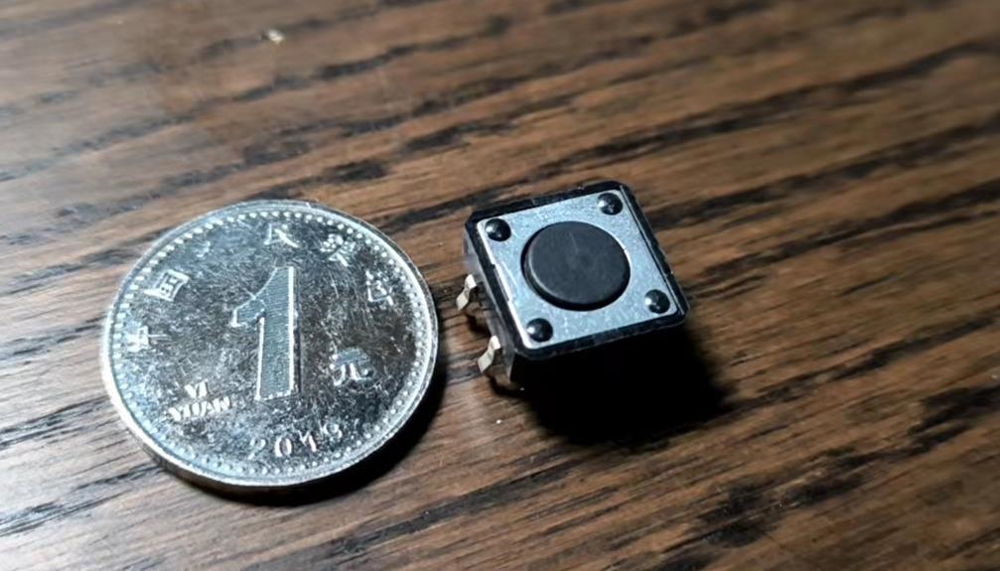
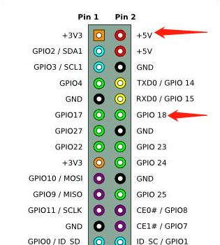
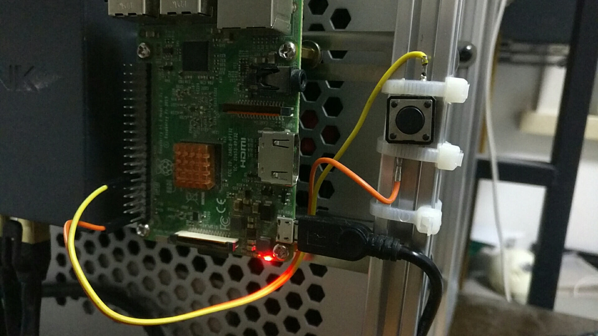
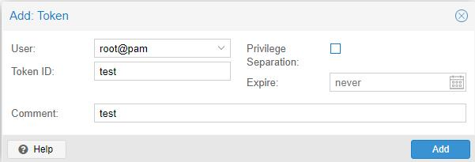
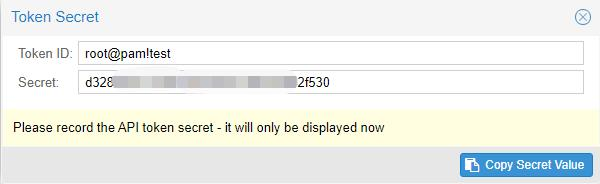
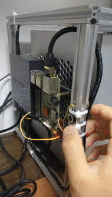

给虚拟机加装一个物理开机键，赋虚拟以实体

## 需求

一直以来，我的服务器在承载诸多服务之外还被作为我的云上开发环境来使用，最近大半年的aquarhome开发全部是在云环境下完成的。使用了这么久之后我发现，一台主机一旦摆脱了物理形骸的束缚，就变得轻盈灵动，它就成为你在网络中的移动城堡。

但虚拟化也有不方便之处，就是即便你在它身边，也只能通过软件界面跟它打交道，由于windows在长期(大概两周）运行时会出现性能问题，所以平时没有开发需要时我会将它关闭。那么当我回到家坐在桌子前打算唤醒它的时候，我却需要拿出另一个设备，登入PVE，找到这台虚拟机，然后启动它。使用手机做这套操作非常繁琐，而如果用电脑的话，那么我使用一台电脑，还需要先使用另一台电脑将它打开，有种迷惑行为的感觉。

那能不能做一个一个物理按键，一键开机？能，但需要树莓派。

## 思路

首先，通过一条指令将PVE中的某台虚拟机开关机是可以实现的，且并不麻烦。PVE作为优秀的开源系统，它的互操作性是极强的，使用通过授权的token可以在http接口上实现任何在WEB界面中的操作。比如配置好token后，调用`https://192.168.0.XX:8006/api2/json/nodes/pve/qemu/104/status/start`这个接口，你就可以完成104这台虚拟机的启动。

那么接下来就是如果让这个过程由按钮触发了。恰好我有一台服役多年的树莓派，在树莓派的pgio引脚上接上一个按键开关并监听开关的状态，这时是非常容易的。

那么至此，思路已经理顺了——树莓派接上按钮，写一个程序监听按钮，一旦按钮按下就触发打开虚拟机的http请求。

## 实现

首先来看按钮，手头最大的按钮就是这个了，它有四个引脚，对角线的引脚是成对的。



我把它接的两极接在了右侧的第1和第6引脚上。第1引脚对应的是5V的高电平，而第6引脚对应的是GPIO18，所以我后续编程时就需要对GPIO18进行监听。



用杜邦线直接插在这两个引脚上，再用鸡屎焊把线的另一头焊在开关引脚上。然后把开关用扎带绑在服务器的框架上。服务器的框架是为了把ITX机箱、硬盘架、树莓派、交换机整合在一起，用铝型材自制的。详情可见我的这篇文章。由于后面测试时并没有发现电平不稳定的情况，所以图省事没有接下拉电阻，按说还需要一个电阻来稳定电平。



硬件完事了以后就可以开始软件部分了。首先要在PVE中获取一个token，在Datacenter中Permissions->API Tokens功能中，点击左上方的add按钮。填写token的名字及备注信息，然后将旁边的Privileget Separation勾选框去掉，这样可以使token具有与当前帐号完全相同的权限。



点击add按钮后你会看到如下信息，下方提示Secret只会在此时显示一次，以后就再也看不到这个序列号了。所以此时要把这个Secret拷出来，保存好。上面的TokenID同样重要，只不过这个值可以通过你自己的帐户信息推断出来。



有了这两个值再配合上上文提到的url，你就可以通过脚本来触发虚拟机的开机动作了。下面是脚本全文，可以说非常简单了核心代码只有十几行，配合注释很容易看懂。实际上代码的框架也是我在网上找的，只需要加上请求发送的逻辑就可以了。使用树莓派开发这种功能确实是方便快捷。

```python
# -*- coding: utf-8 -*-


from RPi import GPIO
import time
import requests
 
# 采用BCM引脚编号
GPIO.setmode(GPIO.BCM)
# 关闭警告
GPIO.setwarnings(False)
# 输入引脚
channel = 18
# 设置GPIO输入模式, 使用GPIO内置的下拉电阻, 即开关断开情况下输入为LOW
GPIO.setup(channel, GPIO.IN, pull_up_down = GPIO.PUD_DOWN)
 
# 检测LOW -> HIGH的变化
GPIO.add_event_detect(channel, GPIO.RISING, bouncetime = 200)
 
# 开关闭合的处理
def on_switch_pressed():
    print('open')
    startWindow()
 
def startWindow():
    user = 'root@pam'
    tokenId = 'aquartest'
    tokenSecret = '191b2b9e-xxxx-xxxx-xxxx-xxxxxxa257e5'
    authInfo = 'PVEAPIToken={0}!{1}={2}'.format(user,tokenId,tokenSecret)
    headers = {'Authorization': authInfo}
    url = 'https://192.168.0.99:8006/api2/json/nodes/pve/qemu/104/status/start'
    body = None
    response = requests.post(url, data=None, headers = headers, verify=False)
    print('request send')
    print(response.content)


try:
    while True:
        # 如果检测到电平RISING, 说明开关闭合
        if GPIO.event_detected(channel):
            on_switch_pressed()
        # 可以在循环中做其他检测
        time.sleep(0.01)     # 10毫秒的检测间隔
except Exception as e:
    print(e)
 
# 清理占用的GPIO资源
GPIO.cleanup()
```

程序保存在树莓派上以后，执行`python windows_switch.py`会发现程序block住了，这时候每当你按下按钮，就会发现命令行打印出了‘open’的日志信息。


再看虚拟机，就已经开始启动了。但这还没完，因为程序一直在前台跑着，如果关掉控制台，那按钮就失效了，所以还需要给这个脚本注册一个服务，让它开机启动。这样一来就可以愉快地使用物理按钮一键开机了，由于这台虚拟机直通了显卡，所以可以在物理显示器上直接显示画面。



## 总结

经过此番调教后，服务器上的windows虚拟机拥有了虚实结合的能力。虚则可以无影无踪又召之即来，实则可以按键开机开屏即用。在家时它直接使用物理设备高效响应，在外面时只要你能接入互联网，它就总有方法伴你左右，像一只精灵随时听你差遣。