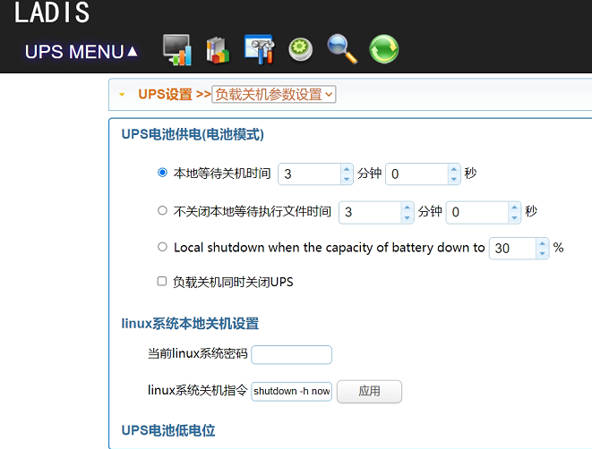

雷迪司Viewpower在pve上的部署

1.打开PVE的web管理页面，进入主节点的shell页面，确认自己处在管理员身份上。

2.从官网上下载linux安装包：

```bash
cd /root/
wget http://www.ladis.com.cn/down/installLADIS\_Linux\_text\_x86\_64.tar.gz
```

3.下载后解压并赋权

```
tar zxvf installLADIS_Linux_text_x86_64.tar.gz installLADIS_Linux_text_x86_64.bin
chmod 777 installLADIS_Linux_text_x86_64.bin
```

4.执行安装程序

```
./installLADIS_Linux_text_x86_64.bin
```

安装时会有一系列提示，默认安装位置为/root/LADIS/，安装过程中几乎不需要修改任何配置，直接回车就可以

5.安装完成后，如果成功，则就已经可以访问ups的web服务了。
在浏览器上输入http://192.168.x.xxx:15178/ViewPower，就可以访问到服务ups的管理服务了。
在左上的UPS MENU菜单中选择UPS设置->负载关机参数设置，进入下方的界面，如果你想在市电停电三分钟后关机，则选择第一项（“本地等待关机时间”）并将等待时间设置为3分钟。



6.设置开机自动启动。使用vi创建一个新的systemd服务配置文件。

```
vi /lib/systemd/system/ups.service
```

文件内容如下：

```
[Unit]
Description=LADIS UPS
After=network-online.target

[Service]
Type=simple
User=root
Group=root
TimeoutStartSec=0
ExecStart=/root/LADIS/StartMain
SyslogIdentifier=LADIS

[Install]
WantedBy=multi-user.target
```

保存后退出，执行`sudo systemctl daemon-reload`，然后执行命令将这个服务设置为开机启动，命令如下：

```
sudo systemctl enable ups.service
```

7.设置完后执行`reboot`重启pve。重启成功后使用`systemctl status ups.service`命令查看服务是否正常启动。如果服务状态为`active (running)`,且web页面访问正常，说明配置成功。